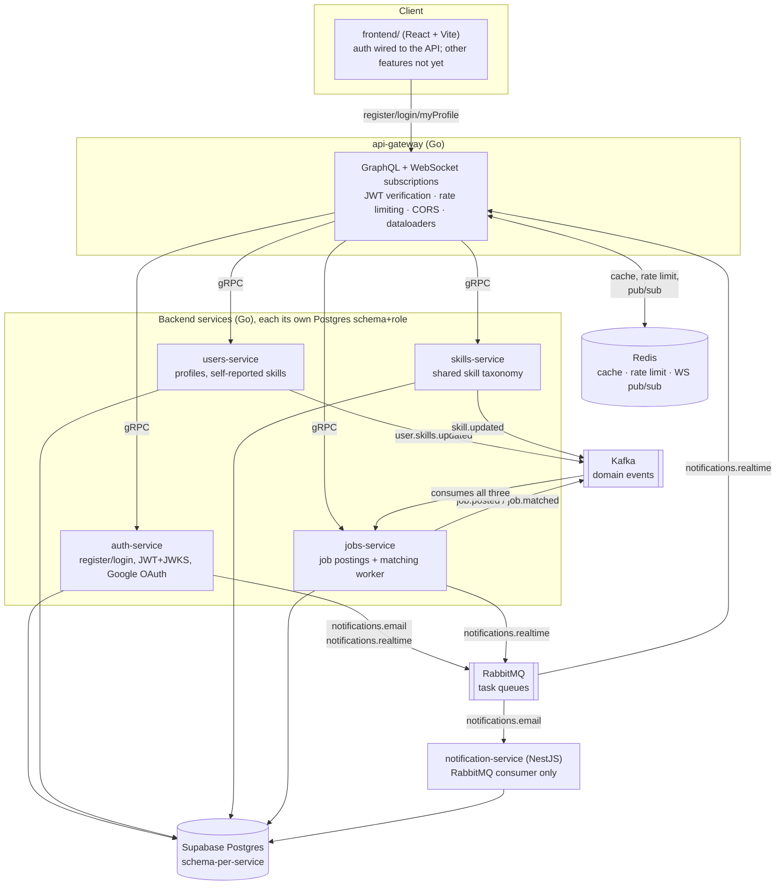

# Architecture Reference

What exists, what it's built with, and how every piece talks to every other piece. `docs/DECISIONS.md` explains *why* each choice was made; this document is the map of *what's actually there* — read it when you need the whole picture at a glance rather than one decision's reasoning.

## System diagram

## Tech stack, by component

| Component | Stack | Talks to the rest of the system via |
|---|---|---|
| `frontend/` | React 19, Vite, TypeScript, Tailwind, shadcn/ui, TanStack Query, Zustand, React Hook Form, Zod, React Router | GraphQL over plain `fetch` (`src/lib/graphql-client.ts`, no Apollo/urql) — currently only register/login/myProfile; see "What's not wired up" below |
| `api-gateway` | Go, `gqlgen` (GraphQL), `graphql-ws` (subscriptions), `golang-jwt`/JWKS client | gRPC (out, to the 4 services) · Redis (cache/rate-limit/pub-sub) · RabbitMQ (consumes `notifications.realtime`) |
| `auth-service` | Go, GORM, bcrypt, `golang-jwt` (RS256), `golang.org/x/oauth2` | gRPC (in, from gateway) · Postgres (`auth` schema) · Kafka (publishes `user.registered`) · RabbitMQ (publishes `notifications.email`, `notifications.realtime`) |
| `users-service` | Go, GORM | gRPC (in) · Postgres (`users` schema) · Kafka (publishes `user.skills.updated`) |
| `skills-service` | Go, GORM, Redis client | gRPC (in) · Postgres (`skills` schema) · Redis (cache) · Kafka (publishes `skill.updated`) |
| `jobs-service` | Go, GORM, Redis client, Kafka client (`franz-go`), RabbitMQ client | gRPC (in) · Postgres (`jobs` schema, incl. its own `user_skill_snapshot`/`job_matches` projections) · Redis (cache) · Kafka (publishes + 3 consumers: snapshot projection, matching worker, cache invalidation) · RabbitMQ (publishes `notifications.realtime`) |
| `notification-service` | NestJS, `amqplib`, plain `pg` (no ORM) | RabbitMQ (consumes `notifications.email` only) · Postgres (`notifications` schema) |
| Shared Go foundation | `internal/platform/{logger,requestid,health,shutdown,db,jwks,cache,kafka,rabbitmq}` | Every Go service builds on this instead of reimplementing it per-service |

Every backend piece talks over **gRPC** (client↔gateway↔services) for request/response calls, **Kafka** for domain events that other services react to, **RabbitMQ** for one-off task-style messages (send this email, push this notification), and **Redis** for anything ephemeral (cache, rate-limit counters, WebSocket fan-out). This split — and why each mechanism was picked for what it's used for, not the others — is explained in `docs/DECISIONS.md`.

## How components work independently vs. as a whole

This is the single most important architectural property to understand:

- **Every service degrades gracefully instead of crashing** when something it depends on isn't reachable — no `DATABASE_URL`, no Redis, no Kafka, no RabbitMQ. Each one starts, serves its health checks, and simply returns a clear "unavailable" error (or silently skips a non-critical feature like caching) for whatever it can't do. This means you can start any single service on its own and it won't fall over just because the rest of the system isn't running.
- **`jobs-service` specifically cannot read `users-service`'s database** — schema-per-service with per-service Postgres roles makes this a hard boundary, not just a convention. Instead, `jobs-service` keeps its own local copy of "which users have which skills" (`jobs.user_skill_snapshot`), kept in sync by consuming `users-service`'s `user.skills.updated` Kafka events. The payoff: **the skill-matching worker keeps working correctly even if `users-service` is completely down** — this was verified live, not just claimed (see `docs/DECISIONS.md`'s Phase 2 notes: `users-service` was killed mid-flow and matching still produced correct results from the snapshot alone).
- **`api-gateway` is the only thing that verifies a JWT.** Backend services trust a verified user ID forwarded as gRPC metadata rather than each re-checking a token — safe because nothing but the gateway can reach them on a private network (local dev, Docker Compose, Kubernetes ClusterIP). In production (`cmd/allinone`, see below), this is even simpler: the four backend gRPC servers only bind to loopback inside the same process, so there's no network path to them at all.
- **Two deployment shapes exist for the same backend code**: full microservices (6 independent Go/Node processes, for local/`kind` practice) and a single combined binary, `backend/cmd/allinone`, which registers all four backend gRPC servers plus the gateway in one process — this is what actually runs in production. Same business logic either way; the seam is only in `cmd/`.

## What's not wired up yet

- **The frontend only calls auth so far** — register, login, and a protected `myProfile` page (see `frontend/README.md` for the pattern: a plain-`fetch` GraphQL client, a Zustand store persisting the JWT to `localStorage`, `react-router` route guarding). Skills, jobs, matching, and the `onNotification` WebSocket subscription have no UI yet — see `docs/PROJECT_OVERVIEW.md` for how to exercise those directly via the GraphQL API in the meantime.
- **Kafka/RabbitMQ don't exist in production** — `cmd/allinone` (what's actually deployed) is synchronous-only. Job matching, the notification log, and realtime WebSocket push are local/`kind`-only features today. See `docs/DEPLOYMENT.md`.

## Testing coverage — confirmed, not assumed

Checked directly (`go test -cover ./...`, `npm test -- --coverage`) rather than assumed:

- **Go business-logic packages** (`internal/*`) mostly have solid coverage: `internal/gateway/realtime` 100%, `internal/gateway/cors` 94%, `internal/gateway/ratelimit` 84%, `internal/platform/shutdown` 65%, `internal/platform/kafka` 64%, `internal/platform/jwks` 60%, `internal/gateway/dataloader` 60%, `internal/jobs` 58%, `internal/skills` 56%, `internal/platform/cache` 51%, `internal/users` 43%, `internal/auth` 39%, `internal/platform/rabbitmq` 33%, `internal/gateway/authctx` 30%, `internal/platform/db` 24%.
- **Not unit-tested, by design**: every `cmd/<service>/main.go` (0% — these are thin wiring/assembly, verified via live end-to-end runs during each phase's build instead of `go test`), and all generated code (`gen/`, gqlgen's `generated/`/`model/` — never test generated code).
- **Genuinely untested, not by design** — small Go utility packages with zero test files: `internal/platform/health`, `internal/platform/logger`, `internal/platform/requestid`. Thin enough that this is a minor gap, not a crisis, but it is a real gap.
- **notification-service (NestJS)**: 19 passing tests, but coverage is uneven — `notifications.service.ts` and `email-notification.ts` are fully covered, `rabbitmq.consumer.ts` is well covered (78%), but `rabbitmq-connection.service.ts` is not (18%) — notably, this is the exact file where Phase 3.5 found and fixed a real lifecycle race condition (see `docs/DECISIONS.md`), and that fix was verified live rather than backed by a new unit test covering the race directly. Worth closing if this project continues.
- **Frontend**: zero tests, no test tooling configured yet (no Vitest wired up). Unlike earlier phases, this is now a real gap, not a "nothing to test yet" — the auth pages have actual logic (form validation, the JWT-decode-locally workaround for `login`'s empty `userId`, protected-route redirects) that a future pass should cover.

**Bottom line: no, not "everything" has unit tests** — the business logic that matters most is well covered, entrypoints and generated code are correctly excluded by convention, but a few specific gaps (the three small Go utility packages, and `rabbitmq-connection.service.ts`'s low coverage) are real and worth knowing about rather than assuming away.
